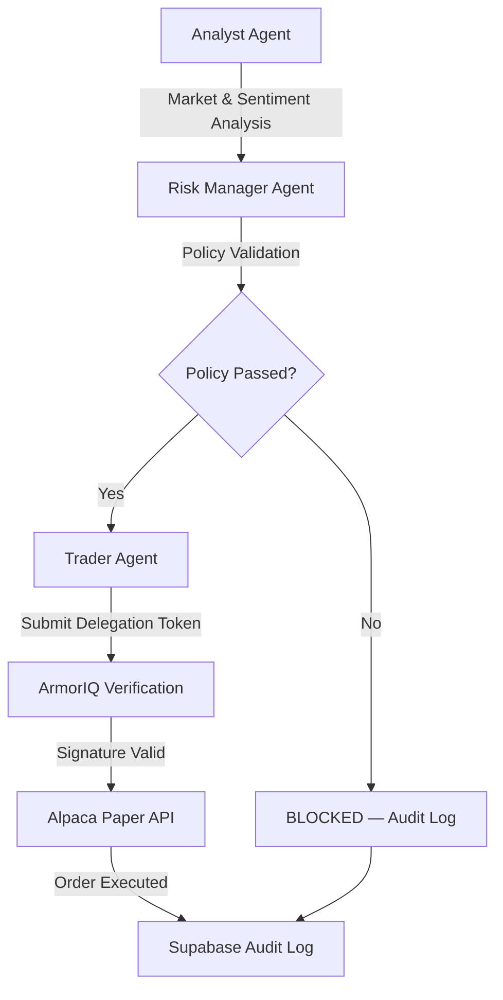

<](https://www.python.org/downloads/)
[](https://nodejs.org/)
[](LICENSE)
[](https://armoriq.ai)

*A deterministic, zero-trust multi-agent financial advisory system built on the OpenClaw framework, secured by **ArmorIQ** intent verification.*

</div>

---

## What Is ShieldTrade?

ShieldTrade is a multi-agent trading platform where three specialized AI agents — **Analyst**, **Risk Manager**, and **Trader** — collaborate to execute paper trades on Alpaca. Every action is secured by a deterministic policy engine and verified through **ArmorIQ's** cryptographic intent tokens, ensuring no agent can exceed its mandate.

### Key Capabilities

| Capability | Description |
|---|---|
| **Multi-Agent Orchestration** | Three agents with strict role boundaries collaborate on trade decisions |
| **ArmorIQ Intent Verification** | Cryptographic tokens bind agent actions to pre-declared plans |
| **Deterministic Policy Engine** | YAML-based rules enforced without LLM interpretation |
| **Delegation Tokens** | Risk Manager must issue time-bound, scoped tokens before any trade |
| **Supabase Audit Trail** | Every policy check and trade event is persisted to Postgres |
| **Alpaca Paper Trading** | Live execution against the Alpaca paper trading sandbox |

---

## Architecture

```
┌─────────────────────────────────────────────────────────────┐
│                      OpenClaw Gateway                       │
│                    (Node.js / TypeScript)                    │
│                                                             │
│  ┌──────────────┐  ┌──────────────┐  ┌──────────────┐     │
│  │   Analyst     │  │ Risk Manager │  │    Trader     │     │
│  │   Agent       │  │    Agent     │  │    Agent      │     │
│  └──────┬───────┘  └──────┬───────┘  └──────┬───────┘     │
│         │                  │                  │             │
│  ┌──────┴──────────────────┴──────────────────┴──────────┐  │
│  │           ArmorIQ Intent Verification Engine           │  │
│  │       (Policy YAML → Cryptographic Intent Tokens)     │  │
│  └───────────────────────────────────────────────────────┘  │
└──────────────────────────┬──────────────────────────────────┘
                           │
           ┌───────────────┼───────────────┐
           ▼               ▼               ▼
    ┌────────────┐  ┌────────────┐  ┌────────────┐
    │  Python     │  │  Supabase  │  │  Alpaca    │
    │  Policy &   │  │  Audit DB  │  │  Paper API │
    │  Bridge     │  │  (Postgres)│  │  (sandbox) │
    └────────────┘  └────────────┘  └────────────┘
```

> See [docs/ARCHITECTURE.md](docs/ARCHITECTURE.md) for the full architecture breakdown.  
> See [docs/SECURITY_MODEL.md](docs/SECURITY_MODEL.md) for the intent model, policy model, and enforcement mechanism.

---

## Quick Start

### Prerequisites

- **Python 3.10+** with `venv`
- **Node.js 18+** with `npm`
- API keys for: **Alpaca** (paper), **Supabase**, **ArmorIQ**, and optionally **Gemini**

### 1. Clone & Install

```bash
git clone https://github.com/Karthi-dev123/ShieldTrade-Ossome-Hacks3.0.git
cd ShieldTrade-Ossome-Hacks3.0

# Python dependencies
python3 -m venv venv
source venv/bin/activate
pip install -r requirements.txt

# Node.js dependencies (proxy server)
npm install
```

### 2. Configure Environment

```bash
cp .env.example .env
# Edit .env with your real API keys
```

Required keys:
| Variable | Purpose |
|---|---|
| `ALPACA_API_KEY` | Alpaca paper trading API key |
| `ALPACA_SECRET_KEY` | Alpaca paper trading secret |
| `ARMORIQ_API_KEY` | ArmorIQ intent verification key |
| `SUPABASE_URL` | Supabase project URL |
| `SUPABASE_SERVICE_KEY` | Supabase service role key |
| `GEMINI_API_KEY` | Google Gemini API key (for LLM proxy) |

### 3. Run the E2E Pipeline

**Linux / macOS / WSL:**
```bash
chmod +x run_shieldtrade.sh
./run_shieldtrade.sh
```

**Windows (CMD / PowerShell):**
```cmd
run_shieldtrade.bat
```

### 4. Run Tests

```bash
source venv/bin/activate
pytest tests/ -v
```

---

## How It Works — The Trade Lifecycle



### Step-by-Step

1. **Analyst** fetches live market data from Alpaca and writes a structured recommendation to `/output/reports/`.
2. **Risk Manager** reads the recommendation, runs it against `config/shieldtrade-policies.yaml`, and if approved, issues a scoped **delegation token** (with a 5-minute TTL).
3. **Trader** reads the delegation token, validates the ArmorIQ cryptographic signature, and executes the order via the Alpaca paper trading API.
4. Every decision — ALLOW or BLOCK — is persisted to **Supabase** for full auditability.

---

## Project Structure

```
shieldtrade/
├── config/
│   ├── openclaw.json                 # OpenClaw multi-agent configuration
│   └── shieldtrade-policies.yaml     # Declarative policy rules
│
├── scripts/
│   ├── alpaca_bridge.py              # Alpaca paper trading CLI
│   ├── policy_engine.py              # Deterministic policy enforcement
│   ├── supabase_logger.py            # Audit trail persistence
│   ├── proxy.js                      # LLM key-rotation proxy
│   ├── run_multi_agent_trade.py      # Full pipeline orchestrator
│   ├── demo_blocked_trade.py         # Intentionally blocked trade demo
│   └── start-all.py                  # Service launcher
│
├── skills/                           # OpenClaw agent definitions
│   ├── shieldtrade-analyst/
│   ├── shieldtrade-risk-manager/
│   └── shieldtrade-trader/
│
├── tests/
│   └── test_e2e_policy_engine.py     # End-to-end policy tests
│
├── docs/
│   ├── ARCHITECTURE.md               # System architecture
│   └── SECURITY_MODEL.md             # Intent, policy, enforcement
│
├── output/                           # Runtime output (gitignored)
├── data/                             # Market data directory
├── .env.example                      # Environment template
├── requirements.txt                  # Python dependencies
├── package.json                      # Node.js dependencies
├── run_shieldtrade.sh                # Linux/macOS runner
├── run_shieldtrade.bat               # Windows runner
└── LICENSE
```

---

## ArmorIQ Integration

ShieldTrade uses [**ArmorIQ**](https://armoriq.ai) as its zero-trust security backbone. ArmorIQ provides:

- **Intent Tokens** — Cryptographic proof that each action was pre-declared in an agent's plan
- **Merkle Proof Verification** — Each tool invocation is checked against the signed action tree
- **Fail-Closed Architecture** — If ArmorIQ is unreachable, all actions are blocked

The ArmorIQ plugin is configured in `config/openclaw.json` and reads policies from `config/shieldtrade-policies.yaml`.

> For the full ArmorIQ SDK reference, see [docs/armoriqdocs.md](docs/armoriqdocs.md).

---

## Policy Engine Reference

The policy engine (`scripts/policy_engine.py`) supports these CLI commands:

```bash
# Check if a trade passes all policy rules
python scripts/policy_engine.py check-trade <agent> <tool> <ticker> <shares> <amount_usd> [domain]

# Verify agent role permissions
python scripts/policy_engine.py check-role <agent> <tool>

# Validate a delegation token
python scripts/policy_engine.py check-delegation '<json_string>'

# Full validation with all checks
python scripts/policy_engine.py validate-all '<json_request>'
```

---

## Contributing

1. Fork the repository
2. Create a feature branch (`git checkout -b feature/my-feature`)
3. Write tests for any new policy rules
4. Submit a pull request

---

## License

MIT — see [LICENSE](LICENSE) for details.

---

<div align="center">
  <sub>Built with 🛡️ by Team Avengers — Secured by <b>ArmorIQ</b></sub>
</div>
]]>
