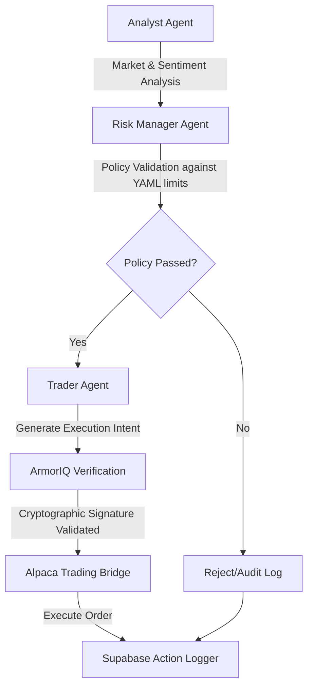

# ShieldTrade

ShieldTrade is a deterministic, highly secure multi-agent financial advisory platform built on the OpenClaw framework. It provides a robust engine for multi-agent orchestration, strict policy enforcement, and zero-trust trade execution securely verified via ArmorIQ.

## Architecture Highlights
- **Multi-Agent Orchestration**: Specialized agents (Analyst, Risk Manager, Trader) collaborating seamlessly to evaluate and execute market decisions.
- **Deterministic Policy Engine**: Highly secure, declarative YAML-based trading limits and validation guardrails.
- **Traceability & Governance**: Fully auditable pipeline with Postgres intent logging via Supabase.
- **Zero-Trust Execution**: Forced API execution constraints utilizing ArmorIQ intent tokens as the core cryptographic verification layer, bridging safely to Alpaca.

---

## System Architecture



---

## 🚀 System Execution

The core engine capabilities can be run and validated via the consolidated End-to-End (E2E) execution script. This script boots the proxy, sequentially routes agent logic, enforces declarative policies, securely handles APIs, and verifies terminal outputs.

### Prerequisites

- Python 3.10+
- Ensure your environment configuration (`.env`) is placed securely in the repository root prior to execution.

### Running the Engine

Execute the system lifecycle using the appropriate script for your host operating system:

**For Mac / Linux / WSL / Git Bash:**
```bash
./run_shieldtrade.sh
```

**For Native Windows (CMD/PowerShell):**
```cmd
run_shieldtrade.bat
```

*Resilience Configuration: To navigate external API rate limiting, the proxy subsystem automatically rotates primary keys. If cloud APIs are degraded, the system supports a graceful switch to local models via Ollama (configured via `USE_OLLAMA=true` in the environment).*

---

## Execution Flow

During execution, the platform naturally routes through the following lifecycle:
1. **Network & Credential Boot**: Validating environment variables and securing proxy/failover readiness.
2. **Analysis Phase**: The Analyst agent models market sentiment and forms a fundamental baseline.
3. **Risk Enforcement**: The Risk Manager reviews proposed decisions strictly against declared YAML policies (validating trading pairs, size limits, and timezones).
4. **Trader Intent Generation**: Generating the final verified API signature via ArmorIQ for execution.
5. **Gateway Auditing**: Persisting the finalized, verified transaction state securely to Supabase logs.
